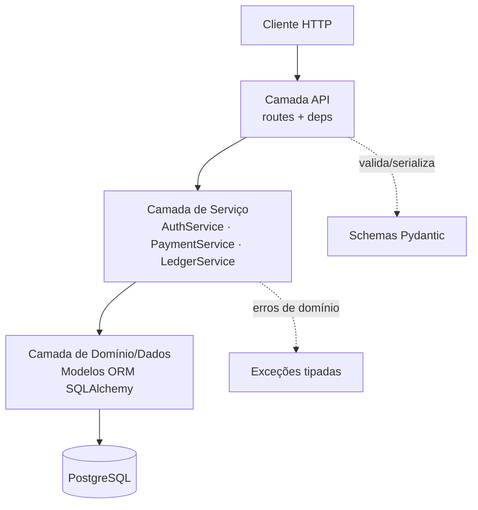
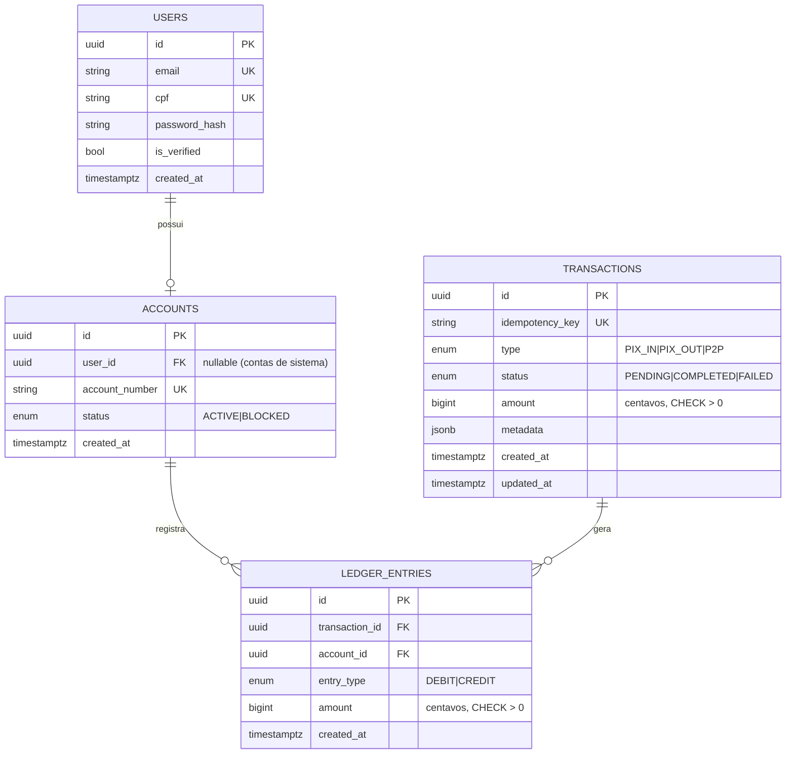
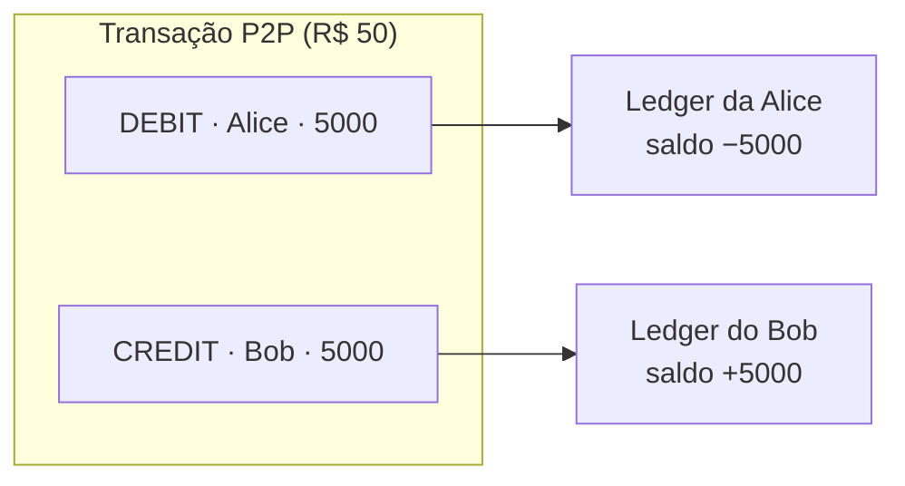
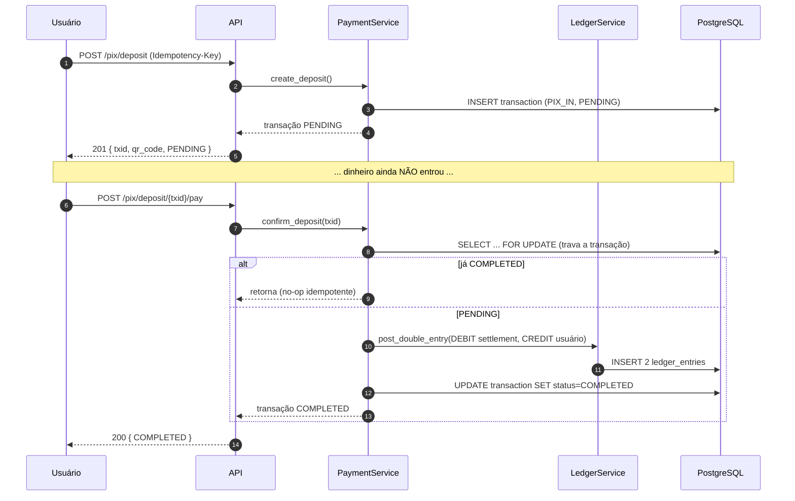
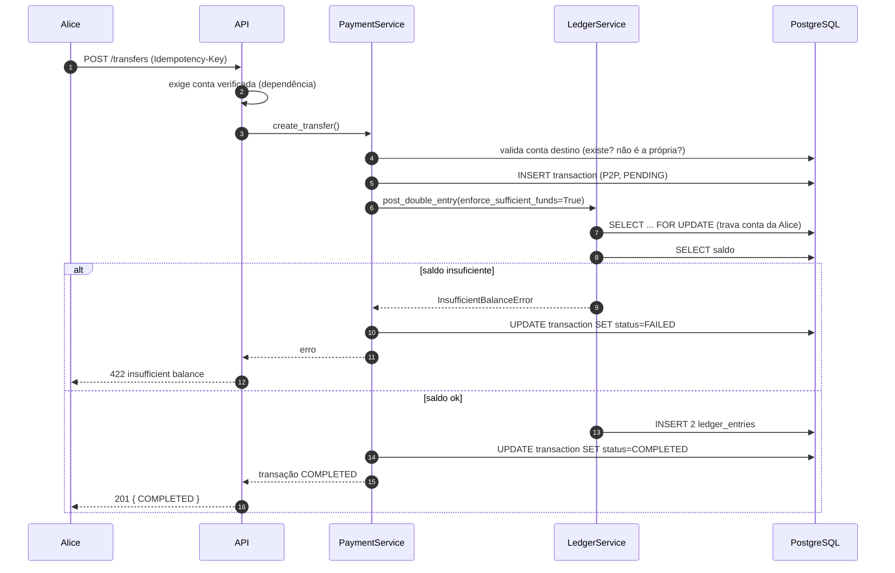
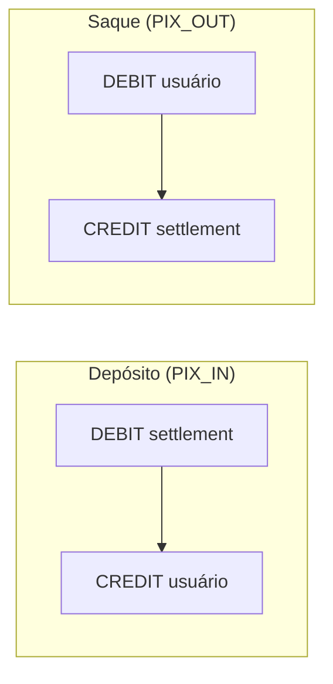
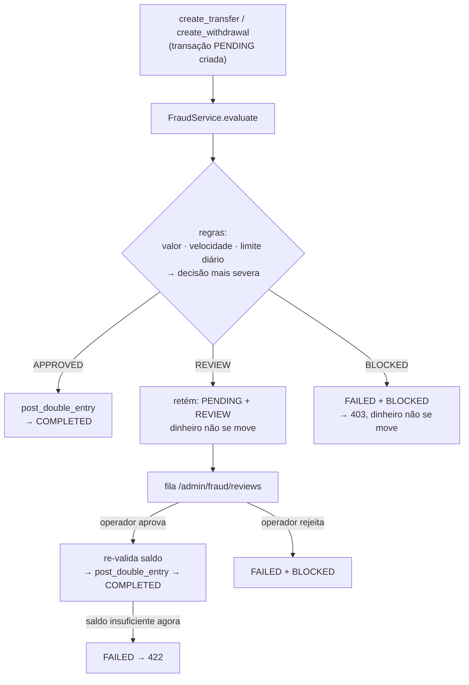
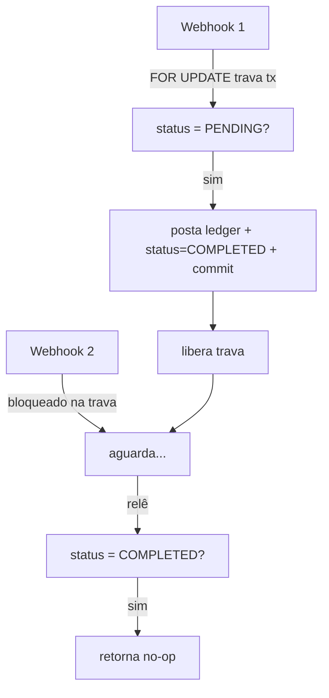
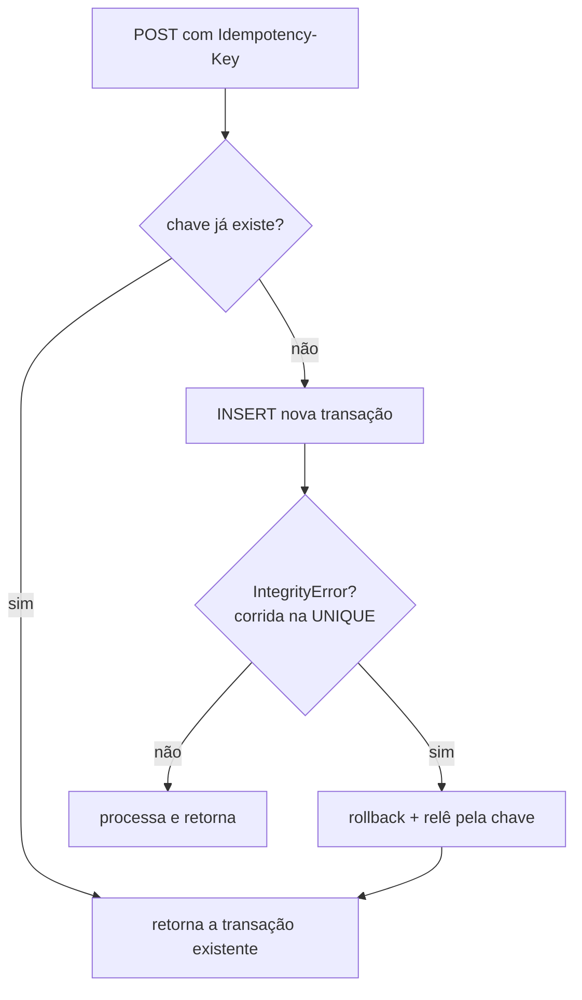
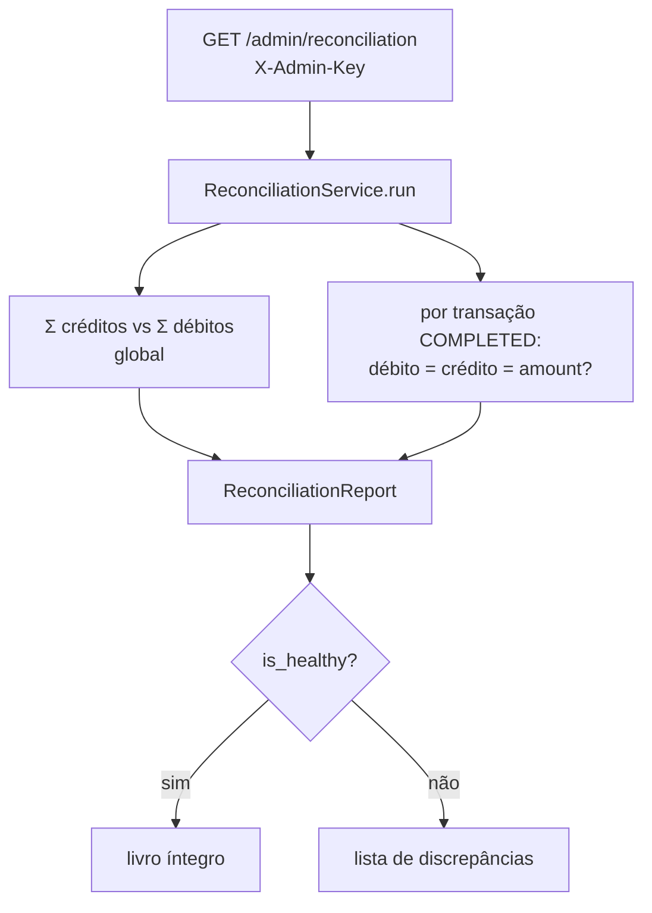

# Documentação Técnica — PayCore Lite

> Documento de arquitetura e engenharia. Público-alvo: pessoas desenvolvedoras e revisoras técnicas
> que precisam entender **como** e **por que** o sistema foi construído desta forma.
>
> Documentos relacionados: [`docs/requisitos.md`](requisitos.md) (regras de negócio, histórias de
> usuário e cenários BDD), [`docs/arquitetura-c4.md`](arquitetura-c4.md) (modelo C4 - contexto,
> contêineres, componentes e código), [`docs/modelo-dados.md`](modelo-dados.md) (dicionário de
> dados completo e histórico de migrações) e [`docs/SEGURANCA.md`](SEGURANCA.md) (controles de
> segurança, limitações conscientes do MVP e matriz de risco).

---

## Sumário

1. [Objetivos e princípios](#1-objetivos-e-princípios)
2. [Visão em camadas](#2-visão-em-camadas)
3. [Modelo de domínio](#3-modelo-de-domínio)
4. [O ledger de partidas dobradas](#4-o-ledger-de-partidas-dobradas)
5. [Fluxos principais](#5-fluxos-principais)
6. [Concorrência e consistência](#6-concorrência-e-consistência)
7. [Idempotência](#7-idempotência)
8. [Representação de dinheiro](#8-representação-de-dinheiro)
9. [Segurança](#9-segurança)
10. [Tratamento de erros](#10-tratamento-de-erros)
11. [Padrões de projeto aplicados](#11-padrões-de-projeto-aplicados)
12. [Decisões de arquitetura (ADRs)](#12-decisões-de-arquitetura-adrs)
13. [Limitações conhecidas e evolução](#13-limitações-conhecidas-e-evolução)

---

## 1. Objetivos e princípios

O PayCore Lite é um MVP de carteira digital cujo objetivo é demonstrar, em pequena escala, os
padrões que sustentam sistemas financeiros de produção. Os princípios que guiam o código:

| Princípio | Como se manifesta |
|---|---|
| **Correção acima de conveniência** | Saldo derivado do ledger, nunca armazenado; dinheiro em inteiros. |
| **O banco é a última linha de defesa** | Constraints `UNIQUE`, `CHECK`, `FK` e travas de linha — não confiamos só na aplicação. |
| **Domínio isolado de infraestrutura** | Os *services* não conhecem HTTP nem Pydantic. |
| **Extensibilidade sem reescrita** | Enums e JSONB permitem adicionar `PIX_OUT`, `FEE`, antifraude etc. sem migração destrutiva. |
| **Tudo verificável** | Cada invariante crítico tem um teste automatizado. |

---

## 2. Visão em camadas

O sistema segue uma **arquitetura em camadas** com dependências apontando sempre para dentro
(regra de dependência): a API depende dos *services*, que dependem dos modelos — nunca o contrário.



**Responsabilidade de cada camada:**

- **API (`app/api`)** — traduz HTTP ↔ domínio. Valida entrada (Pydantic), injeta dependências
  (sessão, usuário, idempotency key) e mapeia exceções de domínio para status HTTP. **Não contém
  regra de negócio.**
- **Serviços (`app/services`)** — o coração. Orquestram regras de negócio e transações. Recebem uma
  `AsyncSession` e trabalham com objetos de domínio. **Não conhecem `Request`, `Response` nem status HTTP.**
- **Domínio/Dados (`app/db`)** — modelos ORM tipados (SQLAlchemy 2.0) e as constraints que
  materializam os invariantes no banco.

---

## 3. Modelo de domínio



**Notas de modelagem:**

- `accounts.user_id` é **nullable** para permitir **contas de sistema** sem dono — em especial a
  *conta de settlement* (`0000000000`), a contrapartida de todo dinheiro que entra/sai via PIX.
- `transactions` é a **unidade de negócio** (a intenção: "depositar", "transferir"); `ledger_entries`
  é o **efeito contábil** (os débitos/créditos que aquela intenção produziu). Uma transação gera
  N entradas — no MVP, sempre um par.
- A coluna se chama `metadata` no banco, mas é mapeada como `extra_data` no Python (`metadata` é
  atributo reservado do SQLAlchemy).

---

## 4. O ledger de partidas dobradas

### O problema com uma coluna `saldo`

```sql
-- ANTIPADRÃO
UPDATE accounts SET balance = balance - 5000 WHERE id = :alice;
UPDATE accounts SET balance = balance + 5000 WHERE id = :bob;
```

Se o processo cair entre os dois `UPDATE`, some dinheiro. Se dois requests rodarem concorrentemente
sem trava, ocorre *lost update*. E não há histórico: o saldo é um número sem proveniência.

### A solução: partidas dobradas

Cada movimento gera **duas entradas imutáveis** de mesmo valor e direção oposta. O saldo é uma
**projeção** desse histórico:

```
saldo(conta) = Σ(créditos da conta) − Σ(débitos da conta)
```



**Invariantes garantidos:**

1. **Soma zero global** — para toda transação, `Σ débitos = Σ créditos`. O sistema como um todo
   nunca cria nem destrói dinheiro; só o move (a conta de settlement absorve a entrada/saída externa).
2. **`amount` sempre positivo** — a direção vem do `entry_type`, nunca do sinal. Reforçado por
   `CHECK (amount > 0)` no banco.
3. **Saldo nunca diverge do histórico** — porque não existe saldo persistido para divergir.

O cálculo do saldo (`LedgerService.get_balance`) é uma agregação `CASE WHEN ... THEN` em SQL:

```sql
SELECT COALESCE(SUM(CASE WHEN entry_type='CREDIT' THEN amount ELSE 0 END), 0)
     - COALESCE(SUM(CASE WHEN entry_type='DEBIT'  THEN amount ELSE 0 END), 0)
FROM ledger_entries
WHERE account_id = :id;
```

---

## 5. Fluxos principais

### 5.1 Depósito PIX (assíncrono em duas fases)

O depósito imita o mundo real: primeiro cria-se uma **cobrança pendente**; o dinheiro só entra
quando a rede PIX **confirma** (aqui simulada pelo endpoint `/pay`, que faz o papel de um webhook).



### 5.2 Transferência P2P



Repare que uma transferência recusada por saldo é registrada como `FAILED` — fica no histórico,
com trilha de auditoria, em vez de simplesmente desaparecer.

### 5.3 Saque PIX (`PIX_OUT`)

O saque é o **espelho do depósito**: em vez de o dinheiro entrar (settlement → usuário), ele sai
(usuário → settlement). Diferente do depósito, o saque **valida fundos** — não se saca o que não se tem.



Como usa `enforce_sufficient_funds=True`, reaproveita exatamente a mesma trava de linha do fluxo de
transferência — sem código novo de concorrência. Um saque sem saldo é registrado como `FAILED`.

**Consequência contábil elegante:** um depósito seguido do saque integral leva a conta de settlement
de volta a zero. Depósito a leva a −X (dinheiro entrou), saque a devolve a 0 (dinheiro saiu). O sistema
permanece em soma-zero em todos os cenários.

### 5.4 Antifraude (screening antes da liquidação)

Transferências e saques passam por um **motor de regras** (`FraudService`) antes de qualquer lançamento
no ledger. O motor executa cada regra e adota a decisão **mais severa** (`APPROVED < REVIEW < BLOCKED`).
Essa decisão é persistida em `transactions.fraud_status` e determina o desfecho.



**Decisões de design que mantêm o núcleo intacto:**

- O `FraudService` roda **como um gate** dentro do `PaymentService` (`_screen`), antes do `post_double_entry` —
  exatamente o ponto de extensão previsto desde o início (ver ADR-06). O `LedgerService` **não muda**.
- As regras são **injetáveis** (`FraudService(session, rules=[...])`), o que permite testes determinísticos
  sem depender dos thresholds de produção, e trocar/estender o conjunto de regras sem tocar no engine.
- As regras de **velocidade** e **limite diário** consultam `ledger_entries` (débitos reais, colunas
  indexadas), não a tabela de transações — refletem dinheiro que efetivamente saiu da conta.
- Uma transação **retida** (`REVIEW`) fica `PENDING` sem lançamentos; a **aprovação manual** executa a
  liquidação naquele momento, **re-verificando o saldo** (que pode ter mudado na fila). Isso trata o caso
  real em que fundos foram gastos enquanto a transação aguardava revisão.
- A idempotência continua valendo: reenviar uma transferência retida (mesma `Idempotency-Key`) devolve a
  mesma transação em revisão, sem criar duplicata.

Depósitos (`PIX_IN`) **não** são triados — dinheiro entrando não caracteriza o risco deste motor. A
conciliação (§8.1) permanece saudável, pois transações retidas/bloqueadas ficam `PENDING`/`FAILED` sem
lançamentos, e o cruzamento só considera transações `COMPLETED`.

---

## 6. Concorrência e consistência

Duas classes de corrida foram tratadas explicitamente, cada uma com um teste dedicado.

### 6.1 Overdraft em transferências concorrentes

**Cenário:** a Alice tem R$ 100 e dispara duas transferências de R$ 60 ao mesmo tempo. Apenas uma
pode passar.

**Mecanismo:** antes de ler o saldo, `post_double_entry` executa `SELECT ... FOR UPDATE` na
**conta que paga** (débito). A segunda transação bloqueia até a primeira commitar; quando prossegue,
relê o saldo já atualizado (R$ 40) e é recusada.

> **Por que travar só o lado do débito?** Creditar uma conta é sempre seguro — só aumenta o saldo.
> O risco (overdraft) existe apenas no débito. Travar somente o débito:
> - **elimina o gargalo** na conta de settlement (compartilhada por todos os depósitos), que de
>   outra forma serializaria o sistema inteiro;
> - **elimina risco de deadlock**, pois no máximo uma linha é travada por operação.

### 6.2 Crédito duplicado em confirmação concorrente de depósito

**Cenário:** o webhook do PIX dispara duas vezes para o mesmo depósito (retry da rede).

**Mecanismo:** `confirm_deposit` faz `SELECT ... FOR UPDATE` **na linha da transação** antes de
checar o status. A segunda chamada bloqueia; ao prosseguir, relê `status = COMPLETED` e retorna sem
lançar novas entradas no ledger. A idempotência é ancorada na própria transação, não numa trava
externa.



### Nível de isolamento

Trabalhamos sob o padrão do PostgreSQL — **READ COMMITTED** — combinado com travas de linha
explícitas onde há disputa. Não dependemos de `SERIALIZABLE`; as travas pontuais são suficientes e
mais performáticas para este modelo.

---

## 7. Idempotência

Toda operação que movimenta dinheiro exige o header `Idempotency-Key: <uuid>`, garantido pela
dependência `get_idempotency_key`. A chave é persistida em `transactions.idempotency_key` com
constraint **`UNIQUE`**.



A defesa acontece em **duas camadas**: verificação otimista na aplicação (evita trabalho) **e** a
constraint `UNIQUE` no banco (garante correção mesmo sob corrida — o `IntegrityError` é capturado e
resolvido relendo a transação já criada).

---

## 8. Representação de dinheiro

Dinheiro é armazenado e trafegado como **inteiro de centavos** (`BigInteger`):

- **Nunca `float`** — `0.1 + 0.2 != 0.3` em ponto flutuante; inaceitável para dinheiro.
- **`int` em vez de `Decimal` na coluna** — para valores em centavos, inteiros são exatos, mais
  rápidos e sem ambiguidade de escala. A conversão para exibição (`R$ 200,00`) é responsabilidade
  da camada de apresentação.
- **`CHECK (amount > 0)`** em `transactions` e `ledger_entries` — valores não-positivos são barrados
  pelo próprio banco.

---

## 8.1 Conciliação (reconciliation)

A conciliação é o mecanismo que **prova continuamente** que o ledger está íntegro. O
`ReconciliationService` cruza as `ledger_entries` com as `transactions` e verifica dois invariantes:

1. **Soma-zero global** — somando todas as entradas, `Σ créditos == Σ débitos`. Dinheiro só é movido,
   nunca criado ou destruído.
2. **Balanço por transação** — para cada transação `COMPLETED`, os totais de débito e crédito devem
   ser iguais entre si **e** iguais ao `amount` da própria transação.



Numa operação correta o relatório é **sempre** saudável. O valor do endpoint é justamente *provar*
isso de forma contínua e **capturar drift** — divergências introduzidas por bugs ou alterações manuais
no banco. O teste `test_reconciliation_detects_a_tampered_ledger` remove deliberadamente uma perna de
débito e confirma que a conciliação sinaliza a transação afetada.

O endpoint é protegido por uma **chave de serviço** (`X-Admin-Key`), não por JWT de usuário — pois
conciliação é uma preocupação de operações/ops, um consumidor servidor-a-servidor, não uma ação de
cliente final. A comparação da chave usa `secrets.compare_digest` (tempo constante) para não vazar
informação por *timing*.

---

## 9. Segurança

Resumo dos controles implementados. Para análise completa (controles SC01-SC11, limitações LC01-LC10, matriz de risco, roadmap de hardening e rastreabilidade), consulte **[`docs/SEGURANCA.md`](SEGURANCA.md)**.

| Aspecto | Implementação |
|---|---|
| Senhas | Hash **bcrypt** (com salt por senha). O hash nunca sai do backend. |
| Autenticação | **JWT** (HS256) com expiração. `sub` = UUID do usuário. |
| Validação de token | `sub` malformado (não-UUID) → **401**, não 500. |
| Autorização KYC | Dependência `VerifiedAccount` centraliza a regra; rotas não a duplicam. |
| Autorização de recurso | `GET /transfers/{id}` só devolve a transferência se a conta atual for origem ou destino. |
| Webhook PIX | `/pay` é intencionalmente **não autenticado** — simula um callback servidor-a-servidor, não uma ação de usuário. |
| Endpoints admin | Protegidos por `X-Admin-Key` (service-to-service), comparada em tempo constante com `secrets.compare_digest`. |
| Antifraude | Transferências e saques passam por triagem de risco antes de liquidar (§5.4); suspeitos são bloqueados ou retidos para revisão manual. |

> ⚠️ **Limitações conscientes do MVP** (documentadas em [`SEGURANCA.md`](SEGURANCA.md)): `/dev/verify-me` aberto para demo, `/pay` sem assinatura de webhook, sem rate limiting. A antifraude cobre valor/velocidade/limite diário, mas não substitui scoring com histórico e listas. Não faça deploy público sem tratar esses pontos.

---

## 10. Tratamento de erros

Os *services* lançam **exceções de domínio tipadas** (`InsufficientBalanceError`,
`AccountNotFoundError`, `TransactionNotFoundError`, `SelfTransferError`, ...). A camada de API é a
**única** que conhece HTTP e faz o mapeamento:

| Exceção de domínio | Status HTTP |
|---|---|
| `EmailAlreadyExistsError` / `CpfAlreadyExistsError` | 409 Conflict |
| `InvalidCredentialsError` | 401 Unauthorized |
| conta não verificada | 403 Forbidden |
| `AccountNotFoundError` (conta destino) | 404 Not Found |
| `TransactionNotFoundError` | 404 Not Found |
| `SelfTransferError` | 400 Bad Request |
| `InsufficientBalanceError` | 422 Unprocessable Entity |

Essa separação mantém o domínio testável sem um servidor HTTP e permite reusar os *services* em
outros contextos (worker, CLI, testes) sem arrastar semântica de status code.

---

## 11. Padrões de projeto aplicados

- **Service Layer** — regra de negócio isolada em `PaymentService`, `LedgerService`, `AuthService`.
- **Dependency Injection** — o FastAPI injeta sessão, usuário atual, conta verificada e idempotency
  key; regras transversais ficam em um único lugar (`app/api/deps.py`).
- **Repository (leve)** — os *services* encapsulam o acesso a dados; as rotas nunca montam queries
  de negócio.
- **Domain Exceptions** — erros de negócio são tipos, não strings nem `HTTPException` vazando do domínio.
- **Ledger / Event-sourcing (parcial)** — o estado (saldo) é derivado de um log imutável de eventos
  (entradas do ledger).
- **Idempotency Key** — padrão clássico de APIs financeiras para operações seguras a retry.
- **Contra-conta (settlement)** — técnica contábil para manter o sistema em soma zero mesmo com
  dinheiro entrando/saindo por fora.

---

## 12. Decisões de arquitetura (ADRs)

Formato enxuto: contexto → decisão → consequência.

**ADR-01 · Ledger em vez de coluna de saldo.**
Sistemas financeiros exigem auditabilidade e não podem tolerar divergência de saldo. → Saldo é
sempre derivado de `ledger_entries`. → Leitura de saldo custa uma agregação (aceitável nesta escala;
mitigável com saldo materializado/snapshot no futuro).

**ADR-02 · Travar apenas a conta de débito.**
Travar ambas as contas criava gargalo global na settlement e risco de deadlock. → `post_double_entry`
trava só o débito, e só quando há validação de fundos. → Depósitos deixam de serializar entre si;
zero deadlock.

**ADR-03 · Idempotência ancorada na transação.**
A dupla confirmação de webhook duplicava crédito. → `confirm_deposit` faz `FOR UPDATE` na transação
e recheca status. → Confirmações concorrentes são seguras sem infraestrutura extra.

**ADR-04 · Dinheiro como inteiro de centavos.**
Ponto flutuante corrompe valores monetários. → `BigInteger` + `CHECK > 0`. → Conversão para formato
humano fica na apresentação.

**ADR-05 · SQLAlchemy async + psycopg 3.**
API totalmente assíncrona exige driver async. → `create_async_engine` com `postgresql+psycopg`. →
No Windows requer `SelectorEventLoop` (configurado em `tests/conftest.py`).

**ADR-06 · Antifraude como gate injetável, não como reescrita do fluxo.**
Fluxos de saída precisam de triagem de risco sem duplicar lógica nem acoplar regras às rotas. → Um
`FraudService` (rule engine com regras injetáveis) roda em `PaymentService._screen`, antes do
`post_double_entry`; `fraud_status` é uma coluna nova e nullable (não altera linhas existentes); a
retenção reusa o estado `PENDING` e a fila de revisão reusa a auth de admin (`X-Admin-Key`). → Fraude
entra sem tocar no `LedgerService`; regras evoluem sem tocar no engine; testes usam regras determinísticas.

---

## 13. Limitações conhecidas e evolução

Escolhas conscientes de escopo para manter o MVP enxuto:

| Limitação atual | Caminho de evolução |
|---|---|
| Leitura de saldo agrega o ledger inteiro | Snapshots periódicos de saldo + soma incremental |
| `/pay` síncrono e não autenticado | Webhook assíncrono (fila Redis) com verificação de assinatura |
| KYC é uma flag booleana | Máquina de estados + upload/análise de documentos |
| Regras de fraude são síncronas e por-transação | Scoring assíncrono, features históricas, listas e modelos de ML |
| Conta de settlement única | Sharding de contas de settlement para maior throughput |
| Conciliação sob demanda (endpoint) | Job agendado periódico + alertas em caso de discrepância |

> **Fase 1 (entregue):** saque PIX (`PIX_OUT`) e conciliação administrativa.
> **Fase 2 (entregue):** motor de antifraude (`FraudService`) com fila de revisão manual.
> Todos como camadas somadas ao núcleo do MVP, sem qualquer reescrita do ledger.

O ponto central: **nenhuma dessas evoluções exige reescrever o núcleo**. O ledger, as transações e
os testes existentes continuam válidos — cada item novo é uma camada adicionada, não uma substituição.
Saque, conciliação e antifraude são a prova disso: entraram sem tocar em `LedgerService.post_double_entry`.
