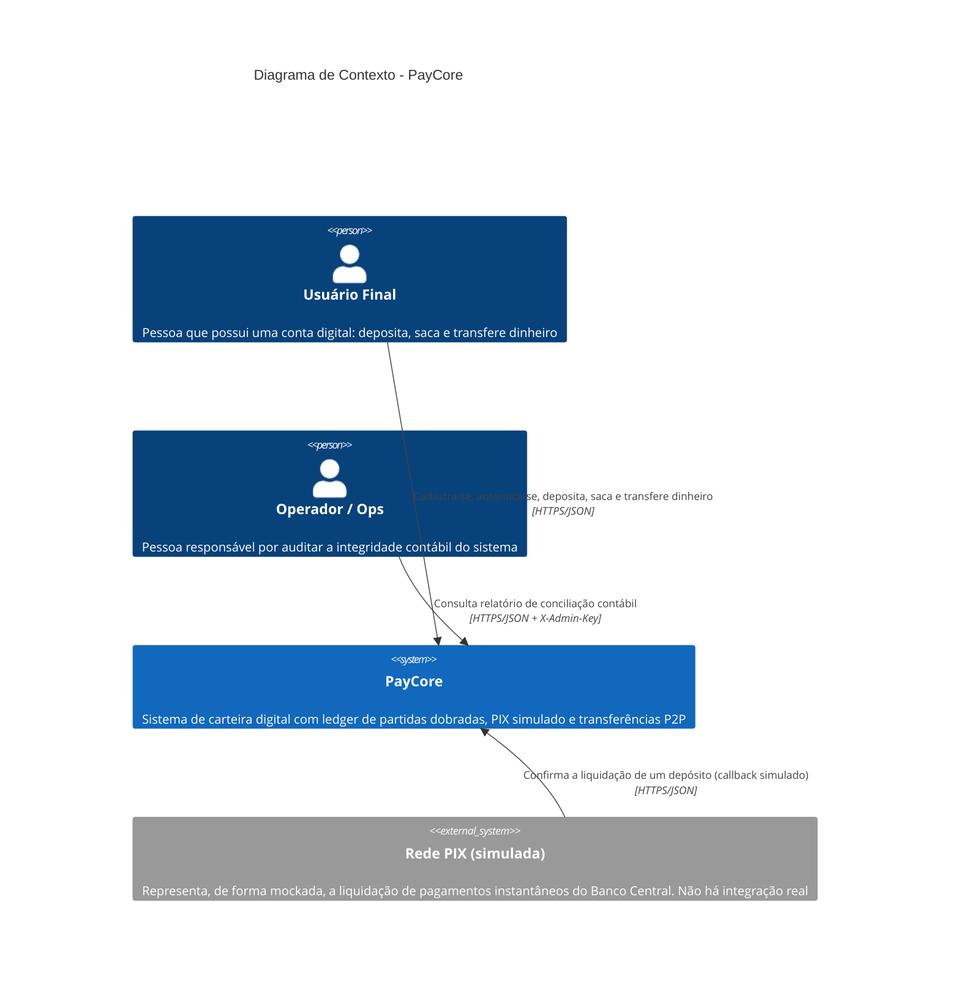
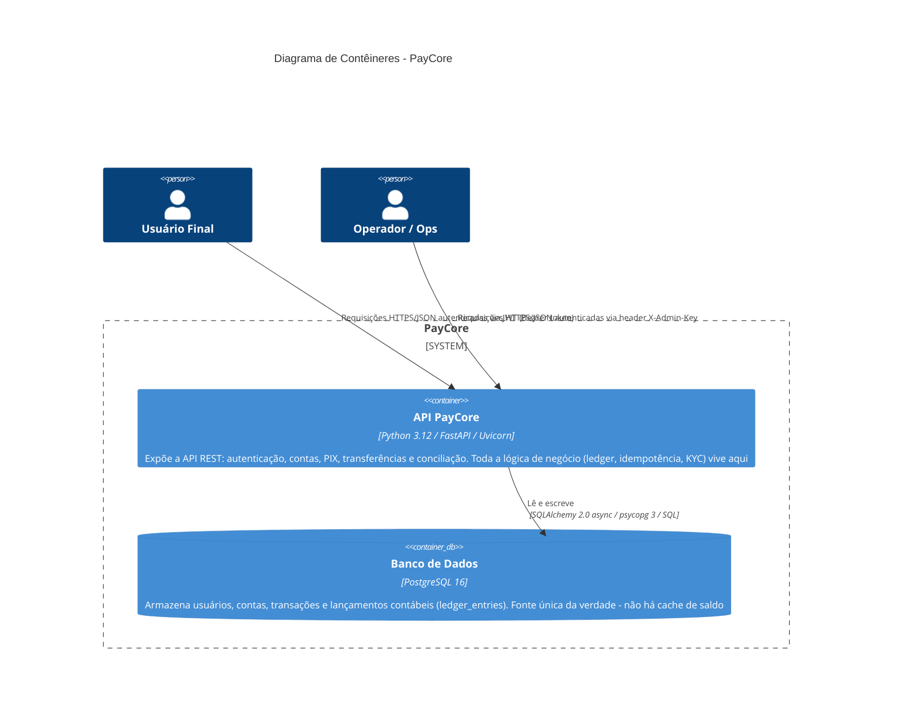
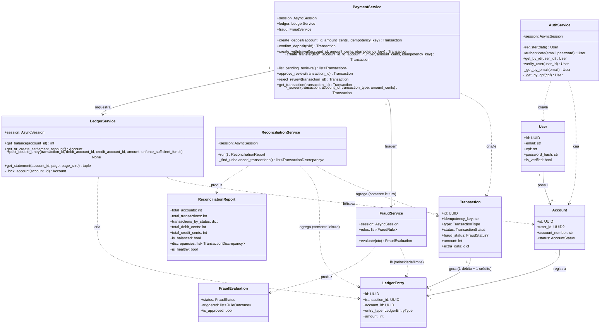

# Arquitetura C4 - PayCore

> Modelo C4 (Context, Container, Component, Code) do PayCore. Complementa o [docs/ARQUITETURA.md](ARQUITETURA.md) (que foca em fluxos de sequência, concorrência e ADRs) com uma visão estrutural em camadas de abstração progressivas - de "o que é o sistema no mundo" até "como os módulos de código se relacionam".

---

## Índice

1. [Nível 1 - Diagrama de Contexto](#1-nível-1---diagrama-de-contexto)
2. [Nível 2 - Diagrama de Contêineres](#2-nível-2---diagrama-de-contêineres)
3. [Nível 3 - Diagrama de Componentes](#3-nível-3---diagrama-de-componentes)
4. [Nível 4 - Diagrama de Código (domínio)](#4-nível-4---diagrama-de-código-domínio)
5. [Mapeamento C4 -> estrutura de pastas](#5-mapeamento-c4---estrutura-de-pastas)

---

## 1. Nível 1 - Diagrama de Contexto

Mostra o PayCore como uma caixa-preta e como ele se relaciona com os atores humanos e sistemas externos. Este é o nível de abstração mais alto: não expõe nenhuma decisão de tecnologia.

**Leitura do diagrama:**

- O **Usuário Final** é o ator principal: interage com todos os fluxos de negócio (auth, conta, PIX, transferência).
- O **Operador/Ops** é um ator interno, sem sobreposição de permissões com o usuário final - ele nunca vê dados de conta de usuários, apenas o agregado de saúde contábil do sistema.
- A **Rede PIX** é um sistema externo *simulado*: no código real (`app/api/routes/pix.py`, endpoint `POST /pix/deposit/{txid}/pay`), este papel é desempenhado por uma chamada direta do próprio cliente de teste/demo, no lugar de um webhook de um provedor de pagamentos real. Isso está documentado explicitamente como fora do escopo do MVP.

---

## 2. Nível 2 - Diagrama de Contêineres

"Abre" o PayCore em suas unidades de execução implantáveis (contêineres, no sentido C4 - não necessariamente Docker) e mostra como elas se comunicam.

**Decisões refletidas neste nível:**

- **Um único contêiner de aplicação.** Não há separação em microsserviços - a API é um monólito modular (ver Nível 3), decisão consciente para um domínio deste tamanho, onde a consistência transacional forte (ACID, `SELECT FOR UPDATE`) entre contas e lançamentos é crítica e mais simples de garantir dentro de uma única transação de banco.
- **PostgreSQL como única dependência de infraestrutura.** Não há Redis, fila de mensagens ou serviço de cache no MVP - reflexo direto do roadmap (webhooks assíncronos e workers ainda não implementados; ver seção 13 do [docs/ARQUITETURA.md](ARQUITETURA.md)).
- **Dois canais de entrada com mecanismos de auth distintos** (JWT para usuário, chave estática para operação) - modelados como relações separadas para deixar explícito que são superfícies de autorização diferentes (ver RN15 em [docs/requisitos.md](requisitos.md)).

---

## 3. Nível 3 - Diagrama de Componentes

"Abre" o contêiner **API PayCore** em seus componentes internos - os módulos Python que compõem a arquitetura em camadas descrita na seção 2 do [docs/ARQUITETURA.md](ARQUITETURA.md).

```mermaid
C4Component
    title Diagrama de Componentes - Contêiner "API PayCore"

    Person(usuario, "Usuário Final")
    Person(operador, "Operador / Ops")
    ContainerDb(db, "PostgreSQL", "Banco de dados")

    Container_Boundary(api, "API PayCore") {
        Component(routes_auth, "Rotas de Auth", "FastAPI APIRouter", "POST /auth/register, /auth/login, /dev/verify-me")
        Component(routes_accounts, "Rotas de Conta", "FastAPI APIRouter", "GET /accounts/me, /accounts/me/statement")
        Component(routes_pix, "Rotas de PIX", "FastAPI APIRouter", "POST /pix/deposit, /pix/deposit/{txid}/pay, /pix/withdraw")
        Component(routes_transfers, "Rotas de Transferência", "FastAPI APIRouter", "POST /transfers, GET /transfers/{id}")
        Component(routes_admin, "Rotas Admin", "FastAPI APIRouter", "GET /admin/reconciliation; fila de fraude /admin/fraud/reviews (list/approve/reject)")

        Component(deps, "Dependências Transversais", "FastAPI Depends", "Sessão de BD, usuário atual, conta verificada (KYC), Idempotency-Key, guarda de admin")

        Component(auth_service, "AuthService", "Serviço de domínio", "Cadastro, autenticação, verificação KYC")
        Component(payment_service, "PaymentService", "Serviço de domínio", "Orquestra depósito, saque e transferência; idempotência; fila de revisão de fraude")
        Component(ledger_service, "LedgerService", "Serviço de domínio", "Núcleo de partidas dobradas: saldo, lançamentos, travas de linha, extrato")
        Component(fraud_service, "FraudService", "Serviço de domínio", "Rule engine de antifraude: valor, velocidade, limite diário -> decisão mais severa")
        Component(reconciliation_service, "ReconciliationService", "Serviço de domínio", "Cruza ledger x transações; detecta discrepâncias contábeis")

        Component(models, "Modelos ORM", "SQLAlchemy 2.0", "User, Account, Transaction, LedgerEntry - com constraints (UNIQUE, CHECK, FK)")
        Component(schemas, "Schemas Pydantic", "Pydantic v2", "Validação de entrada/saída HTTP, serialização")
        Component(security, "Segurança", "bcrypt / python-jose", "Hash de senha, emissão e validação de JWT")
    }

    Rel(usuario, routes_auth, "usa")
    Rel(usuario, routes_accounts, "usa")
    Rel(usuario, routes_pix, "usa")
    Rel(usuario, routes_transfers, "usa")
    Rel(operador, routes_admin, "usa")

    Rel(routes_auth, deps, "usa")
    Rel(routes_accounts, deps, "usa")
    Rel(routes_pix, deps, "usa")
    Rel(routes_transfers, deps, "usa")
    Rel(routes_admin, deps, "usa")

    Rel(routes_auth, auth_service, "chama")
    Rel(routes_accounts, ledger_service, "chama")
    Rel(routes_pix, payment_service, "chama")
    Rel(routes_transfers, payment_service, "chama")
    Rel(routes_admin, reconciliation_service, "chama")
    Rel(routes_admin, payment_service, "chama (fila de revisão)")

    Rel(deps, security, "valida token via")
    Rel(deps, models, "consulta usuário/conta via")

    Rel(auth_service, security, "usa (hash/verify de senha)")
    Rel(auth_service, models, "lê/escreve")
    Rel(payment_service, ledger_service, "orquestra")
    Rel(payment_service, fraud_service, "triagem antes de liquidar")
    Rel(payment_service, models, "lê/escreve")
    Rel(ledger_service, models, "lê/escreve")
    Rel(fraud_service, models, "lê ledger (velocidade/limite)")
    Rel(reconciliation_service, models, "lê (somente leitura)")

    Rel(routes_auth, schemas, "valida com")
    Rel(routes_pix, schemas, "valida com")
    Rel(routes_transfers, schemas, "valida com")
    Rel(routes_admin, schemas, "valida com")

    Rel(models, db, "mapeia (SQLAlchemy async)")

    UpdateLayoutConfig($c4ShapeInRow="4", $c4BoundaryInRow="1")
```

**Princípios de design deste nível** (detalhados nos ADRs do [docs/ARQUITETURA.md](ARQUITETURA.md)):

- **Regra de dependência de fora para dentro.** Rotas dependem de serviços; serviços dependem de modelos. Nunca o inverso. Nenhum serviço importa `fastapi` ou conhece `HTTPException`/status HTTP - eles lançam exceções de domínio próprias (`InsufficientBalanceError`, `AccountNotFoundError`, `TransactionNotFoundError`, `SelfTransferError`, ...), e é a camada de rotas quem as traduz para códigos HTTP.
- **`PaymentService` orquestra, `LedgerService` executa.** `PaymentService` conhece o vocabulário de negócio (depósito, saque, transferência, idempotência); `LedgerService` só conhece o vocabulário contábil (débito, crédito, saldo, trava de linha). Essa separação é o que permite adicionar `PIX_OUT` (saque) sem tocar em `post_double_entry`.
- **`ReconciliationService` é somente leitura e não tem acoplamento com `PaymentService`/`LedgerService`.** Propositalmente: ele audita o resultado desses serviços a partir do estado persistido, não reaproveita a lógica deles - garantindo que um bug em `LedgerService` não "esconda" o mesmo bug na verificação.
- **`Dependências Transversais` (`app/api/deps.py`) centraliza regras que, de outra forma, se repetiriam em cada rota** - notavelmente a verificação de KYC (`VerifiedAccount`), que antes da revisão sênior estava duplicada entre as rotas de PIX e de transferência (ver RN10 no [docs/requisitos.md](requisitos.md)).

---

## 4. Nível 4 - Diagrama de Código (domínio)

Nível opcional do C4, usado aqui apenas para o núcleo de domínio (`app/services/` + `app/db/models.py`), onde as relações entre classes concentram a maior parte da complexidade de negócio do sistema.

**Notas de leitura:**

- `PaymentService` tem uma dependência de **composição** com `LedgerService` (`self.ledger = LedgerService(session)`), não de herança - reforça que orquestração e contabilidade são responsabilidades compostas, não uma especialização da outra.
- `ReconciliationService` deliberadamente **não** depende de `PaymentService` nem de `LedgerService` - apenas dos modelos ORM, para auditar de forma independente.
- Cada `Transaction` gera exatamente **2** `LedgerEntry` no modelo atual (um débito, um crédito) - a cardinalidade "1 → 2" no diagrama é o retrato exato de RN03 (seção 4 do [docs/requisitos.md](requisitos.md)), não uma simplificação.

---

## 5. Mapeamento C4 -> estrutura de pastas

Referência rápida de onde cada componente do Nível 3 vive no repositório:

| Componente (C4) | Caminho no repositório |
|---|---|
| Rotas de Auth | `app/api/routes/auth.py` |
| Rotas de Conta | `app/api/routes/accounts.py` |
| Rotas de PIX | `app/api/routes/pix.py` |
| Rotas de Transferência | `app/api/routes/transfers.py` |
| Rotas Admin | `app/api/routes/admin.py` |
| Dependências Transversais | `app/api/deps.py` |
| AuthService | `app/services/auth.py` |
| PaymentService | `app/services/payment.py` |
| LedgerService | `app/services/ledger.py` |
| FraudService | `app/services/fraud.py` |
| ReconciliationService | `app/services/reconciliation.py` |
| Modelos ORM | `app/db/models.py`, `app/db/base.py`, `app/db/session.py` |
| Schemas Pydantic | `app/schemas/*.py` |
| Segurança | `app/core/security.py` |
| Configuração | `app/core/config.py` |
| Ponto de entrada | `app/main.py` |
| Migrações de banco | `alembic/versions/*.py` |
