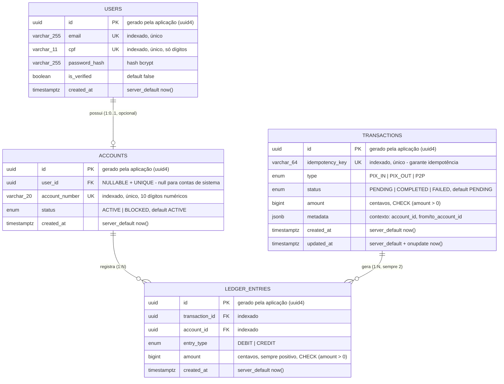

# Modelo de Dados - PayCore

> Documento de referência do esquema físico do banco de dados. Complementa a seção 3 do [docs/ARQUITETURA.md](ARQUITETURA.md) (visão de domínio) com o **dicionário de dados completo**, os **enums nativos**, o **histórico de migrações** e as **estratégias de evolução de schema**. Gerado a partir do código-fonte real (`app/db/models.py`) e das migrações aplicadas (`alembic/versions/`).

---

## Índice

1. [Diagrama Entidade-Relacionamento](#1-diagrama-entidade-relacionamento)
2. [Dicionário de dados](#2-dicionário-de-dados)
3. [Enums nativos do PostgreSQL](#3-enums-nativos-do-postgresql)
4. [Índices e constraints](#4-índices-e-constraints)
5. [Histórico de migrações (Alembic)](#5-histórico-de-migrações-alembic)
6. [Contas de sistema](#6-contas-de-sistema)
7. [Decisões de modelagem](#7-decisões-de-modelagem)

---

## 1. Diagrama Entidade-Relacionamento

**Cardinalidades e o que elas expressam:**

- `USERS 1 --- 0..1 ACCOUNTS`: um usuário tem no máximo uma conta (`user_id` é `UNIQUE` em `accounts`). O "0" do lado das contas existe porque a **conta de settlement** não tem usuário (`user_id = NULL`) - ver seção 6.
- `ACCOUNTS 1 --- N LEDGER_ENTRIES`: uma conta acumula quantos lançamentos forem necessários ao longo do tempo; o saldo é a soma projetada desse relacionamento (ver RN02 em [docs/requisitos.md](requisitos.md)).
- `TRANSACTIONS 1 --- N LEDGER_ENTRIES`: no modelo atual, N é sempre exatamente **2** (um débito e um crédito) - é uma decisão de negócio (RN03), não uma limitação técnica do schema. O schema permitiria N diferente de 2 no futuro (ex.: uma transação com taxa gerando 3 lançamentos: débito do pagador, crédito do destinatário, crédito da taxa).

---

## 2. Dicionário de dados

### 2.1 `users`

| Coluna | Tipo (SQLAlchemy) | Tipo (PostgreSQL) | Nulo? | Constraint | Descrição |
|---|---|---|---|---|---|
| `id` | `UUID(as_uuid=True)` | `uuid` | Não | `PRIMARY KEY` | Identificador do usuário, gerado no cliente Python via `uuid.uuid4()` (não `gen_random_uuid()` do banco) |
| `email` | `String(255)` | `varchar(255)` | Não | `UNIQUE`, índice `ix_users_email` | E-mail de login, validado como `EmailStr` na entrada |
| `cpf` | `String(11)` | `varchar(11)` | Não | `UNIQUE`, índice `ix_users_cpf` | CPF normalizado (somente dígitos) na camada de schema antes de persistir |
| `password_hash` | `String(255)` | `varchar(255)` | Não | - | Hash `bcrypt` da senha; a senha em texto puro nunca é persistida nem logada |
| `is_verified` | `Boolean` | `boolean` | Não | `default=False` | Flag de verificação KYC (ver RN10) |
| `created_at` | `DateTime(timezone=True)` | `timestamptz` | Não | `server_default=now()` | Definido pelo banco, não pela aplicação |

### 2.2 `accounts`

| Coluna | Tipo (SQLAlchemy) | Tipo (PostgreSQL) | Nulo? | Constraint | Descrição |
|---|---|---|---|---|---|
| `id` | `UUID(as_uuid=True)` | `uuid` | Não | `PRIMARY KEY` | Identificador da conta |
| `user_id` | `UUID(as_uuid=True) \| None` | `uuid` | **Sim** | `FOREIGN KEY (users.id)`, `UNIQUE` | **Nullable de propósito** para permitir contas de sistema sem dono (ver seção 6 e RN04) |
| `account_number` | `String(20)` | `varchar(20)` | Não | `UNIQUE`, índice `ix_accounts_account_number` | Número de 10 dígitos gerado por `generate_account_number()`, com checagem de colisão em até 5 tentativas |
| `status` | `Enum(AccountStatus)` | `account_status` (enum nativo) | Não | `default=AccountStatus.ACTIVE` | `ACTIVE` ou `BLOCKED`. `BLOCKED` está modelado mas ainda não é acionado por nenhuma regra de negócio implementada (reservado para antifraude futuro) |
| `created_at` | `DateTime(timezone=True)` | `timestamptz` | Não | `server_default=now()` | - |

### 2.3 `transactions`

| Coluna | Tipo (SQLAlchemy) | Tipo (PostgreSQL) | Nulo? | Constraint | Descrição |
|---|---|---|---|---|---|
| `id` | `UUID(as_uuid=True)` | `uuid` | Não | `PRIMARY KEY` | Também usado como `txid` exposto na API de depósito (o `txid` retornado ao cliente **é** o `id` da transação, sem indireção) |
| `idempotency_key` | `String(64)` | `varchar(64)` | Não | `UNIQUE`, índice `ix_transactions_idempotency_key` | Chave enviada pelo cliente no header `Idempotency-Key`; garante que retries não dupliquem o efeito (RN08) |
| `type` | `Enum(TransactionType)` | `transaction_type` (enum nativo) | Não | - | `PIX_IN`, `PIX_OUT` ou `P2P` (ver seção 3) |
| `status` | `Enum(TransactionStatus)` | `transaction_status` (enum nativo) | Não | `default=TransactionStatus.PENDING` | `PENDING`, `COMPLETED` ou `FAILED` |
| `amount` | `BigInteger` | `bigint` | Não | `CHECK (amount > 0)` (`ck_transactions_amount_positive`) | Valor em **centavos**. Nunca ponto flutuante (RN12) |
| `extra_data` (coluna física `metadata`) | `JSONB` | `jsonb` | Não | `default=dict` | Contexto livre da transação: `{"account_id": "..."}` (depósito/saque) ou `{"from_account_id": "...", "to_account_id": "..."}` (transferência). Mapeado como `extra_data` no Python porque `metadata` é atributo reservado da `DeclarativeBase` do SQLAlchemy |
| `created_at` | `DateTime(timezone=True)` | `timestamptz` | Não | `server_default=now()` | - |
| `updated_at` | `DateTime(timezone=True)` | `timestamptz` | Não | `server_default=now()`, `onupdate=now()` | Atualizado automaticamente pelo SQLAlchemy a cada `UPDATE` no ORM (ex.: transição de `PENDING` para `COMPLETED`/`FAILED`) |

### 2.4 `ledger_entries`

| Coluna | Tipo (SQLAlchemy) | Tipo (PostgreSQL) | Nulo? | Constraint | Descrição |
|---|---|---|---|---|---|
| `id` | `UUID(as_uuid=True)` | `uuid` | Não | `PRIMARY KEY` | Identificador do lançamento contábil |
| `transaction_id` | `UUID(as_uuid=True)` | `uuid` | Não | `FOREIGN KEY (transactions.id)`, índice `ix_ledger_entries_transaction_id` | A transação de negócio que originou este lançamento |
| `account_id` | `UUID(as_uuid=True)` | `uuid` | Não | `FOREIGN KEY (accounts.id)`, índice `ix_ledger_entries_account_id` | A conta afetada por este lançamento |
| `entry_type` | `Enum(LedgerEntryType)` | `ledger_entry_type` (enum nativo) | Não | - | `DEBIT` ou `CREDIT` - a **direção** do lançamento nunca é expressa pelo sinal do `amount` |
| `amount` | `BigInteger` | `bigint` | Não | `CHECK (amount > 0)` (`ck_ledger_entries_amount_positive`) | Sempre positivo, em centavos. A regra RN03 é reforçada: o único jeito de saber se é entrada ou saída é olhar `entry_type` |
| `created_at` | `DateTime(timezone=True)` | `timestamptz` | Não | `server_default=now()` | Timestamp exato do lançamento; usado para ordenação do extrato (mais recente primeiro) |

> **Observação central de design:** não existe coluna de saldo em nenhuma tabela. O saldo de uma `account` é sempre a agregação `SUM(CASE WHEN entry_type='CREDIT' THEN amount ELSE 0) - SUM(CASE WHEN entry_type='DEBIT' THEN amount ELSE 0)` sobre `ledger_entries` filtrado por `account_id` (`LedgerService.get_balance`). Isso é o que torna o saldo **impossível de divergir** do seu histórico.

---

## 3. Enums nativos do PostgreSQL

O PayCore usa **tipos `ENUM` nativos do PostgreSQL** (via `sqlalchemy.Enum`), não `VARCHAR` com `CHECK IN (...)` nem tabelas de lookup. Essa escolha favorece integridade forte e leitura eficiente, ao custo de exigir `ALTER TYPE` para evoluir os valores (ver seção 5).

| Enum PostgreSQL | Valores | Usado em | Observação |
|---|---|---|---|
| `account_status` | `ACTIVE`, `BLOCKED` | `accounts.status` | `BLOCKED` reservado para uso futuro (antifraude) |
| `transaction_type` | `PIX_IN`, `PIX_OUT`, `P2P` | `transactions.type` | `PIX_OUT` foi adicionado **após** o schema inicial via `ALTER TYPE ... ADD VALUE` (migração `2bfdbfff13c8`), sem qualquer downtime ou reescrita de dados |
| `transaction_status` | `PENDING`, `COMPLETED`, `FAILED` | `transactions.status` | Toda transação nasce `PENDING` e transiciona uma única vez para `COMPLETED` ou `FAILED` - nunca retrocede |
| `ledger_entry_type` | `DEBIT`, `CREDIT` | `ledger_entries.entry_type` | Nunca muda após a criação do lançamento (lançamentos são imutáveis) |

No lado Python, cada enum é espelhado por uma classe `StrEnum` em `app/db/models.py` (`AccountStatus`, `TransactionType`, `TransactionStatus`, `LedgerEntryType`), o que permite comparação direta com strings (`transaction.status == "COMPLETED"` funciona) mantendo tipagem estática no restante do código.

---

## 4. Índices e constraints

### 4.1 Chaves primárias
Todas as quatro tabelas usam `UUID` como chave primária, gerado na aplicação (`default=uuid.uuid4`) - não pelo banco. Isso permite que o `id` de uma entidade seja conhecido **antes** do `INSERT` (útil, por exemplo, para referenciar o `transaction_id` ao construir os `ledger_entries` na mesma unidade de trabalho).

### 4.2 Chaves estrangeiras

| FK | Origem | Destino | On Delete |
|---|---|---|---|
| `accounts.user_id` -> `users.id` | `accounts` | `users` | Padrão (`RESTRICT` implícito do Postgres) |
| `ledger_entries.account_id` -> `accounts.id` | `ledger_entries` | `accounts` | Padrão |
| `ledger_entries.transaction_id` -> `transactions.id` | `ledger_entries` | `transactions` | Padrão |

> Diferente de outros sistemas do portfólio, o PayCore **não usa `ON DELETE CASCADE`** em nenhuma FK: registros financeiros (`ledger_entries`, `transactions`) não devem ser apagáveis por efeito colateral de uma exclusão em cascata - a exclusão de dados financeiros é, por design, uma operação que não existe na API pública.

### 4.3 Constraints de unicidade (`UNIQUE`)

| Constraint | Tabela | Coluna(s) | Motivo de negócio |
|---|---|---|---|
| `ix_users_email` | `users` | `email` | RN01 - um e-mail, um usuário |
| `ix_users_cpf` | `users` | `cpf` | RN01 - um CPF, um usuário |
| (implícita via `unique=True` no FK) | `accounts` | `user_id` | Um usuário tem no máximo uma conta |
| `ix_accounts_account_number` | `accounts` | `account_number` | RN01 - número de conta é identificador público único |
| `ix_transactions_idempotency_key` | `transactions` | `idempotency_key` | RN08 - garante idempotência mesmo sob corrida (constraint de banco, não só checagem de aplicação) |

### 4.4 Constraints de verificação (`CHECK`)

| Constraint | Tabela | Expressão | Adicionada em |
|---|---|---|---|
| `ck_transactions_amount_positive` | `transactions` | `amount > 0` | Migração `acf930e39d05` |
| `ck_ledger_entries_amount_positive` | `ledger_entries` | `amount > 0` | Migração `acf930e39d05` |

Essas duas constraints são a **última linha de defesa** para RN12: mesmo que um bug futuro no código Python tentasse persistir um valor zero ou negativo, o banco rejeitaria a operação.

### 4.5 Índices de performance (não-únicos)

| Índice | Tabela | Coluna | Motivo |
|---|---|---|---|
| `ix_ledger_entries_account_id` | `ledger_entries` | `account_id` | Acelera `get_balance` e `get_statement` (ambos filtram por `account_id`) |
| `ix_ledger_entries_transaction_id` | `ledger_entries` | `transaction_id` | Acelera a busca dos dois lançamentos de uma transação (usada pela conciliação) |

---

## 5. Histórico de migrações (Alembic)

| Revisão | Nome | O que faz |
|---|---|---|
| `09a75fcf872e` | *initial schema* | Cria as 4 tabelas (`transactions`, `users`, `accounts`, `ledger_entries`), seus índices e FKs. Schema inicial do MVP (`PIX_IN`, `P2P`) |
| `acf930e39d05` | *add amount check constraints* | Adiciona `CHECK (amount > 0)` em `transactions` e `ledger_entries` - reforço de RN12 feito após a revisão sênior do código |
| `2bfdbfff13c8` | *add PIX_OUT transaction type* | `ALTER TYPE transaction_type ADD VALUE IF NOT EXISTS 'PIX_OUT'` - habilita o saque PIX sem reescrever nenhuma linha existente |

**Padrão observado:** cada migração corresponde a uma decisão de negócio rastreável (ver seção 9 do [docs/requisitos.md](requisitos.md)), nunca a uma alteração "solta" de schema. A ordem de aplicação (`down_revision` encadeado) foi validada rodando `alembic upgrade head` **do zero** em um banco descartável, garantindo que a cadeia de migrações funciona de forma determinística em qualquer ambiente novo (CI, onboarding, produção).

**Limitação conhecida e documentada:** a migração `2bfdbfff13c8` tem um `downgrade()` no-op - o PostgreSQL não suporta remover um valor de um `ENUM` sem recriar o tipo inteiro (o que exigiria reescrever toda referência a ele). Essa decisão está documentada no próprio arquivo de migração como comentário.

---

## 6. Contas de sistema

A tabela `accounts` acomoda dois tipos de linha, diferenciados por `user_id`:

| Tipo | `user_id` | Exemplo | Propósito |
|---|---|---|---|
| Conta de usuário | preenchido (FK válida) | qualquer conta criada via `POST /auth/register` | Representa a carteira de uma pessoa |
| **Conta de sistema** | `NULL` | conta de **settlement**, `account_number = "0000000000"` | Contrapartida contábil de dinheiro que entra/sai via PIX (RN04) |

A conta de settlement é criada **sob demanda** (lazy) pelo método `LedgerService.get_or_create_settlement_account()` na primeira vez que um depósito ou saque é confirmado - não existe *seed* de dados para ela nas migrações. Isso significa que, em um banco recém-criado sem nenhuma transação PIX, a tabela `accounts` não contém nenhuma conta de sistema até a primeira operação de depósito/saque.

O campo `user_id` foi deliberadamente modelado como **nullable** (em vez de exigir um "usuário de sistema" fictício com CPF/e-mail fake) porque isso evitaria dados sintéticos poluindo a tabela `users`, que deve conter exclusivamente pessoas reais.

---

## 7. Decisões de modelagem

Resumo das decisões que mais diferenciam este modelo de um CRUD financeiro convencional (cada uma detalhada com contexto completo em [docs/ARQUITETURA.md](ARQUITETURA.md), seção 12 - ADRs):

1. **Sem coluna de saldo** - saldo é sempre uma projeção de `ledger_entries` (ADR-01).
2. **Dinheiro como `BigInteger` em centavos** - nunca `Decimal`/`NUMERIC`, nunca `float` (ADR-04). `BigInteger` (8 bytes) foi escolhido em vez de `Integer` (4 bytes, limite ~21 milhões de reais) para não impor um teto de valor artificialmente baixo.
3. **`metadata` como JSONB, não colunas fixas** - o contexto de cada tipo de transação (`account_id` para PIX, `from_account_id`/`to_account_id` para P2P) varia por `type`; usar `JSONB` evita uma tabela cheia de colunas nulas dependendo do tipo, mantendo o schema relacional enxuto (4 tabelas) enquanto o domínio evolui (ex.: adicionar taxas no futuro não exige nova coluna).
4. **Enums nativos em vez de `VARCHAR` livre** - o banco recusa qualquer valor fora do conjunto válido, sem depender de validação de aplicação como única barreira.
5. **UUIDs gerados na aplicação, não no banco** - permite que o `PaymentService` monte múltiplos objetos relacionados (uma `Transaction` e seus 2 `LedgerEntry`) referenciando o mesmo `id` antes de qualquer `INSERT`, sem precisar de um round-trip ao banco para obter o ID gerado.
